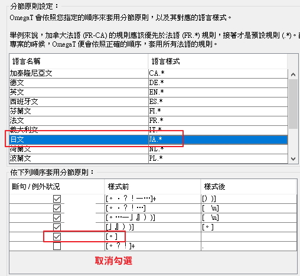
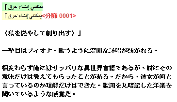

# README

> OmegaTPortable 為 [OmegaT](http://omegat.org/) 翻譯工具的免安裝版本 可以方便的把設定檔備份以及帶著走

## Download

以下連結僅分流的網站不同而已

* [OmegaTPortable](https://github.com/bluelazy/OmegaTPortable/archive/master.zip) (github)
* [mediafire](http://www.mediafire.com/file/b1cyd7b5zn3br5n/OmegaTPortable.rar) (mediafire)

### Desc

* 支援詞彙表功能方便查看譯名與取代
* 簡易的翻譯記憶 可以幫助處理翻譯過的重覆內容
* 可以匯入 txt 以及 word 檔

### 免安裝版

* 此免安裝版已整合進部分非官方預設值以及部分插件
* txt 譯文預設會輸出為 utf8 編碼
* 更改了官方原文分節樣式

* 設定值儲存於 `Data/settings`
* 如需自行更新替換版本 請取代 `App/bin` 內的檔案即可

## 簡易教學

* [簡易教學範例](Other/簡易教學範例.md)

## Links

* [【来翻译吧】轻松愉快的辅助翻译工具OmegaT的简单使用教程](https://tieba.baidu.com/p/5007147073 "【来翻译吧】轻松愉快的辅助翻译工具OmegaT的简单使用教程")
* [OmegaT --- 開放源碼電腦翻譯輔助程式（CAT Tool） - OpenFoundry](https://www.openfoundry.org/tw/tech-column/1559)
* [OmegaT 官方線上手冊](http://omegat.sourceforge.net/manual-latest/)

### 官方連結

* [OmegaT](http://omegat.org/)
* [Sourceforge](https://sourceforge.net/projects/omegat/)
* [Github](https://github.com/omegat-org/)
* [Twitter](https://twitter.com/OmegaTOfficial)
* [Facebook](https://www.facebook.com/OmegaTOfficial)

## FAQ

> 以下已整合進預設值 基本上無需自行設定

### txt 文件編碼

> txt 編碼即使是 utf8 甚至更改檔名為 utf8 輸出之後的譯文仍然是亂碼

1. 將 設定 > 檔案過濾器 > `Remove leading and trailing whitespace in non-segmented project` 取消勾選

### 如何取消依照句號來段落分節

> 取消前

> 取消後

